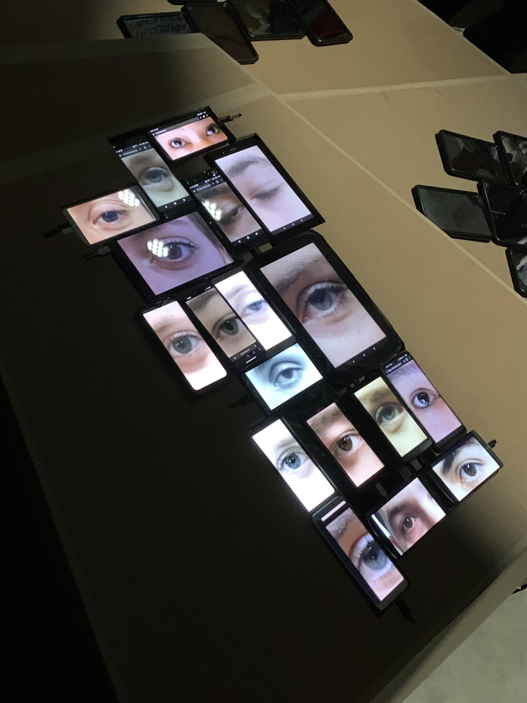

# Flanerie


## 🗒 Prérequis

**🔨 Hardware**
- Un réseau wifi / routeur
- Plusieurs smartphones ou tablettes récentes
- Un ordinateur | raspi

**💽 Software**
- [Docker](https://docs.docker.com/get-docker/)

## Quickstart

```bash
docker-compose up
```

Vous pouvez maintenant créer une nouvelle room à `http://localhost:3000/control/myroom` et la joindre à un appareil à `http://localhost:3000/myroom`

L'appareil devrait s'afficher sur la page `/control`.

Pour ajouter une nouvelle vidéo, copiez vos fichiers mp4 dans `www/video`, ils seront affichés sur la page `/control`.

## 🚴 Utilisation

La prototype diffuse automatiquement des vidéos sur les appareils connectés à la room.

## ❤️ Contributeurices
[maigre](https://github.com/maigre) 

[bloffique- théatre](https://bloffique-theatre.com/)